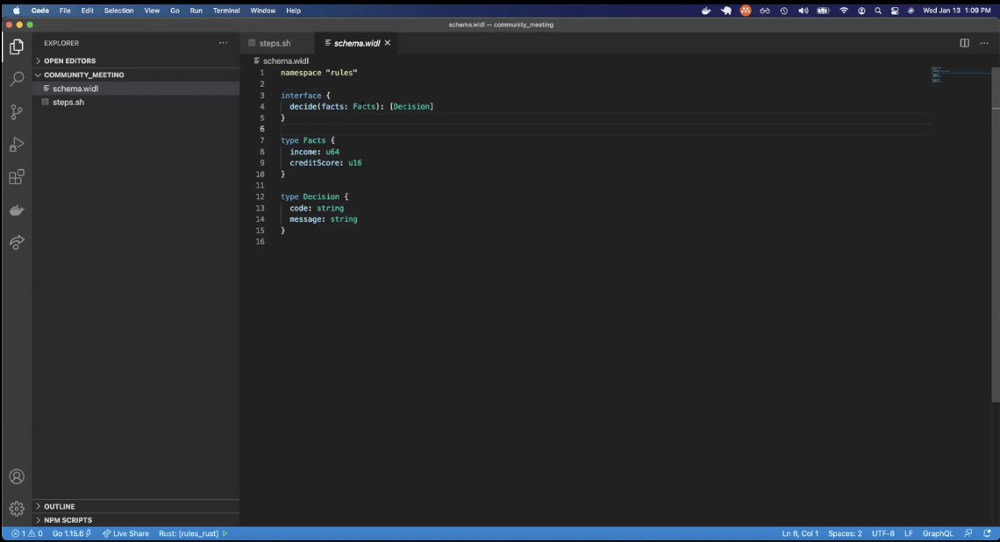

**wasmCloud Community Meeting - 2021-1-20**

**Attendees**

**Goal**

Enable developers to build their functions and services in WebAssembly and run them everywhere.

**Introductions**

*   Gustav - consultancy
*   Daz - ex-Googler

**Demo**

*   Next Demo: 2021-1-20 Phil Kedy: WIDL 
*   Today: [wapc cli](https://github.com/wapc/cli)
    *   NxN problem
    *   Leverages MessagePack
        *   No IDL
        *   So created a fit for purpose for WebAssembly
        *   Numeric types for example align to WebAssembly
    *   This is contract first development

    *   Step 1 - setup your data model and array
        *   Schema.widl
        *   Expand up on data types
            *   nest them
            *   make them options (?)
            *   brackets represent list
            *    arrays 
            *   maps, etc
        *   Expressed in wild → wasm int def lang
    *   Step 2
        *   Like yeoman, we need to initialize the scaffold
        *   We pick a template and a language
        *   Codegen.yaml
            *   There are templates that 
        *   Index.ts → generates the first time
*   Step 3
    *   Put it in your project and then make
*   Step 4
    *   Build your project around 
*   Demo here:
    *   [https://github.com/wapc/rules-demo](https://github.com/wapc/rules-demo)
    *   Works like GRPC → generates all of the functions server-side and client-side stubs
*   The difference here between waPC and was time
    *   Wapc: in the demo/use case we build a very domain-specific app 
    *   Wasmtime: when the wapc wasm his loaded here, it’ is loosely coupled

### Deployment Options

*   wasmCloud
*   custom
*   Krustlet is another existing deployment option
    *   [https://github.com/deislabs/krustlet/blob/master/docs/howto/README.md](https://github.com/deislabs/krustlet/blob/master/docs/howto/README.md)
*   Krustlet on GKE
    *   https://github.com/deislabs/krustlet/blob/master/docs/howto/krustlet-on-gke.md
*   Lambda
*   Go runtime in a terraform provider
    *   https://github.com/EvilSuperstars/terraform-provider-wapc \

**Community News**

*   wasmTime community meeting is Thursday 1/21/2020 at 1:00
    *   [Meeting Agenda](https://docs.google.com/document/d/1ZtxZNWbTNIhDdIXt27NQdwuc6D5O288l5HZKc_wC0FQ/edit#)

**wasmCloud Current**

*   Reminder: Azure Registry Complete
    *   enable public anonymous pull (downloads) on azure container register.
    *   [Wasmcloud.azurecr.io](http://wasmcloud.azurecr.io/) configured for public
*   wasmCloud site update progress
*   [Actor-interfaces](https://github.com/wasmCloud/actor-interfaces/issues)
*   [Wash REPL](https://github.com/wasmCloud/wash/issues)
*   Krustlet, cut to new release (hold till release)
    *   Need to move the provider over to repo
    *   Then cut it over 
    *   Lot’s in flight - kube, tokyo, etc
*   

Review - .15 open tickets

*   Remaining To do on .15
    *   Packaging
        *   Home Brew
            *   Current manual process
            *   The checksum and release is manual
        *   Arm type packages
            *   
    *   Automation for builds on wasmCloud repo
        *   
    *   Azure Registry
        *   wasmCloud
*   Demo Script Updates for the new wasmCloud Experience:
    *   [https://docs.google.com/document/d/11QWnLiep4B3F2KOr7kYBNumgYqFVdXf6Jur_7tLTM04/edit?usp=sharing](https://docs.google.com/document/d/11QWnLiep4B3F2KOr7kYBNumgYqFVdXf6Jur_7tLTM04/edit?usp=sharing)

**Post Call Chat: waPC and Interface Types**

You have to serialize the data without interface types

	Protobuff, json, etc

	No other magic thing

	Need interface types & module types

	When we have interface types

		When dealing with stateless, then lifting and lower is done w/ long-lived pointers

		Avoid explicit allocation and waPC contract

	On lift and lower concern on speed

		Controlled by wasmtime

	What’s in wasmtime now

		Need to do some more digging into this

	Kevin concerns

		Generating stuff like wasm bind gen → shims in JS where you can create an object on the host side which is a point to an object on the guest side

		This pointer lasts longer than one message call

		Must guarantee that between messages it doesn’t change

			Think garbage collected pointers

			We want to be an engine and language-neutral

			After the method call, we can destroy the wasm w/ no negative consequences

		What we want is no explicitly mem allocations for state or pointers

			Otherwise, waPC won’t go

	All made with guest calls

		Not an automatic adoption → need to see multiple implementations

		Kevin wants to pass by value, not pass by reference

		waPC makes two copies

			If there is shared memory we can use it

			Will be baby steps to achieve the goal

	waPC means you don’t care about interface types

		Don’t care between the two

**Open PRs / Issue Review**

*   [https://github.com/wasmCloud/wasmCloud/issues](https://github.com/wasmCloud/wasmCloud/issues)
*   [https://github.com/wasmCloud/wasmCloud/pulls](https://github.com/wasmCloud/wasmCloud/pulls)
*   ADL (Architecture Decision Log)
    *   [https://wasmcloud.github.io/adr/](https://wasmcloud.github.io/adr/)

	

**waSCC Topic Backlog**

*   2020-1-13
    *   Demo: WIDL, Phil Kedy
    *   Demo: waPC, Phil Kedy
*   2020-1-20
    *   Bindle
    *   https://github.com/deislabs/bindle/
*   Demo: Code gen + API easier to use
    *   [https://github.com/wasmcloud/actor-interfaces](https://github.com/wasmcloud/actor-interfaces)
    *   Need Go & Assembly Script
    *   
*   Docs Rewrite
*   Criticial Stack
*   
*   wasmCloud
*   Krustlet larger update
*   ADL (Architecture Decision Log)
    *   [https://wascc.github.io/adr/](https://wascc.github.io/adr/)
    *   ADL for register usage
*   Katakota Tutorials
*   Krustlet / wasm3 on small devices
    *   Constrained & JIT experience issues
*   EdX online class is January
    *   Another source of learning and documentation 
*   Yeoman / wapc generator

**Shared To Do:**

What / Who / When

*   

**Post Call Feedback**

Discusion

*   Why did wasmCloud use wasm3 by default?
    *   Why jit vs. 
*   We should call to action and test with wasmTime and not just default wasm3
*   Should we have an experimental branch
    *   To see how they work together
*   Other features
    *   Wasm simd for example
    *   Wasmtime has it, do other engines like wasm3?
    *   That feature is less esoteric than wasi-nn